# Desafio do PicPay Simplificado

Essa é minha resolução do [desafio backend proposto pelo PicPay](https://github.com/PicPay/picpay-desafio-backend):

- O PicPay Simplificado é uma plataforma de pagamentos apenas com funcionalidades básicas.
- Nela é possível depositar e realizar transferências de dinheiro entre usuários.
- Temos 2 tipos de usuários, Clientes e Lojistas, ambos têm carteira com dinheiro e podem realizar transferências.
- A realização de transferências depende de um serviço autorizador externo, que determina se a operação pode acontecer ou não.
- Em caso de sucesso da transferência, o recebedor deve ser notificado da transação, através de um serviço externo de notificação.
- Ambos os serviços externos podem estar estar indisponíveis no momento que são chamados (precisamos tratar esses casos no código).

Temos 3 pontos principais neste projeto:

- A consistência dos dados é fundamental (o dinheiro não pode sumir nem surgir do nada)
- A segurança dos dados também é fundamental (apenas você pode transferir/consultar seu dinheiro)
- O envio de notificações deve ser feito de maneira assíncrona, tornando o sistema resiliente a falhas

Resumo do que você vai encontrar aqui:

- API C#/.Net + documentação com Scalar
- Mais de 100 testes automatizados
- CI/CD com o GitHub Actions
- Deploy no Railway (Api + Postgres + Worker)
- Processamento assíncrono de eventos e tarefas em background
- Gestão de erros e reprocessamento de eventos/tarefas
- Concorrência e paralelismo + consistência financeira

## 0️⃣ Sumário

- 1️⃣ Regras de Negócio
- 2️⃣ Arquitetura
- 3️⃣ Casos de Uso
- 4️⃣ Referências

## 1️⃣ Regras de Negócio

- Existem dois tipos de usuários no sistema: Clientes e Lojistas

- Usuários possuem Nome, Documento, E-mail e Senha:
    - Documentos e e-mails devem ser únicos no sistema
    - O sistema deve permitir apenas um cadastro com o mesmo Documento ou E-mail

- Clientes podem realizar transferências para Lojistas ou outros Clientes

- Lojistas só recebem transferências, não enviam

- Antes de finalizar a transferência, deve-se consultar um serviço autorizador externo (https://util.devi.tools/api/v2/authorize)

- Após a transferência:
    - O cliente ou lojista precisa receber uma notificação (email, sms) enviada por um serviço externo (https://util.devi.tools/api/v1/notify)
    - Eventualmente este serviço pode estar indisponível/instável

> 🆙 As regras a seguir foram adicionadas por mim, para deixar o projeto mais desafiador

- Existe um terceiro tipo de usuário no sistema, o Adm:
    - Ele será responsável pela gestão do sistema como um todo, tendo acesso aos dados de clientes e lojistas

- A API terá autenticação e autorização:
    - Endpoins para cadastro de usuários e para realização de login

- A notificação será enviada de maneira assíncrona:
    - Teremos um evento de Transferência Realizada, que vai disparar uma tarefa em background para enviar a notificação
    - Vamos usar uma política de retentativa simples, caso o serviço externo retorne algum erro

- Bônus de Boas-Vindas:
    - Todo Cliente que se cadastrar no PicPay, receberá um bônus no valor de R$ 10,00
    - O valor desse bônus sairá da carteira do Adm

- Cliente deve poder acessar:
    - Seu saldo atual
    - Extrato com todas as suas transações
    - Listagem com todas as suas notificações

- Lojista deve poder acessar:
    - Seu saldo atual
    - Extrato com todas as suas transações
    - Listagem com todas as suas notificações

- Adm deve poder acessar:
    - Dados de consistência financeira
    - Informações sobre Clientes e Lojistas

## 2️⃣ Arquitetura

O sistema é formado por 4 componentes:
- API (ASP.NET)
- Worker (Hangfire)
- Vendors (serviços externos de autorização e notificação)
- Banco (PostgreSQL)

  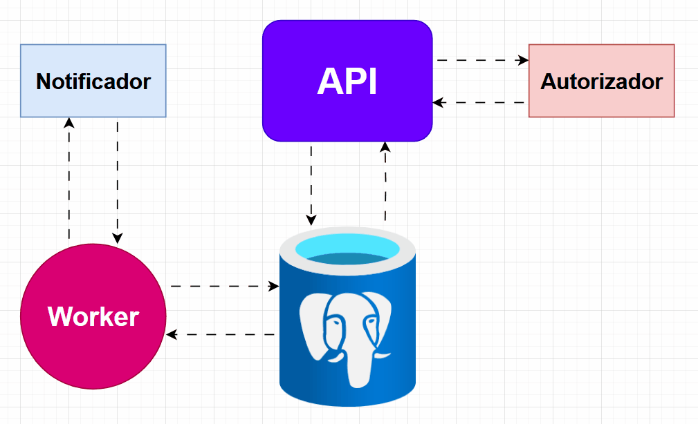

A API é responsável por executar a maioria dos fluxos de negócio, como cadastro, login e transferência.

Durante o processamento de um request pela API, pode haver a emissão de algum evento de domínio.
Esse evento é então processado pelo Worker em um processo separado, de forma que a API entrega a resposta pro cliente o mais rápido possível.
O Worker então processa com o evento disparando alguma tarefa em background, como o envio da notificação de transferência recebida, por exemplo.

O banco é bem simples, poucas tabelas já dão conta de todas as funcionalidades:

  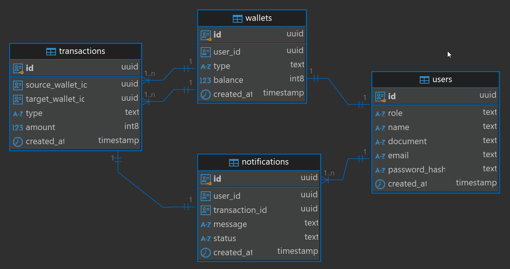

Para os Vendors, criei uma API própria que vai servir de "mock" nos ambientes de desenvolvimento e testes.
Essa API possui o endpoint do autorizador (/api/v2/authorize) e o endpoint do notificador (/api/v1/notify).
Dessa forma, basta apontar para a url da API de Vendors nos testes. Em prod, basta usar as urls fornecidas pela PicPay.
Também adicionei certa lógica dentro desses endpoints também, como por exemplo, sempre desautorizar transferências no valor de R$ 6,00.

## 3️⃣ Casos de Uso

A seguir temos todos os casos de uso do sistema.
Cada um deles possui um respectivo teste automatizado validando seu comportamento.
Coloquei prints de código em alguns a título de exemplo.

### Cadastro de Clientes
- Deve cadastrar com sucesso quando todos os dados forem válidos
- Não deve cadastrar quando o CPF for inválido
- Não deve cadastrar quando o email for inválido
- Não deve cadastrar quando a senha for fraca
- Não deve cadastrar quando o CPF já estiver vinculado com outro cliente
- Não deve cadastrar quando o email já estiver vinculado com outro cliente
- Dois requests com os mesmos CPF e email feitos no mesmo instante devem cadastrar apenas um usuário

Esse último cenário é mostrado a seguir, onde disparo dois requests simultâneos com os mesmos dados, a fim de validar que o sistema vai cadastrar apenas um usuário e retornar erro no outro request.

  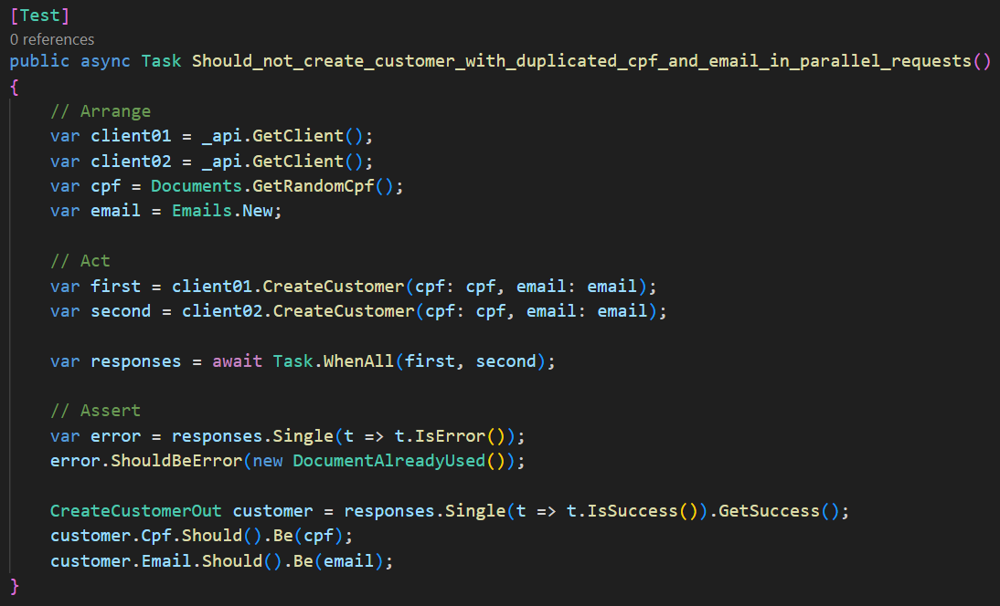

### Cadastro de Lojistas
- Deve cadastrar com sucesso quando todos os dados forem válidos
- Não deve cadastrar quando o CNPJ for inválido
- Não deve cadastrar quando o email for inválido
- Não deve cadastrar quando a senha for fraca
- Não deve cadastrar quando o CNPJ já estiver vinculado com outro lojista
- Não deve cadastrar quando o email já estiver vinculado com outro lojista
- Dois requests com os mesmos CNPJ e email feitos no mesmo instante devem cadastrar apenas um usuário

### Login
- Deve conseguir logar tanto como cliente quanto como lojista
- Não deve logar quando o usuário não existir
- Não deve logar quando a senha estiver incorreta

### Bônus de Boas-Vindas
- Clientes novos devem receber um bônus de R$ 10,00
- Lojistas não devem receber esse bônus
- A criação de clientes em paralelo deve manter o saldo de todas as carteiras consistente (soma zero)

  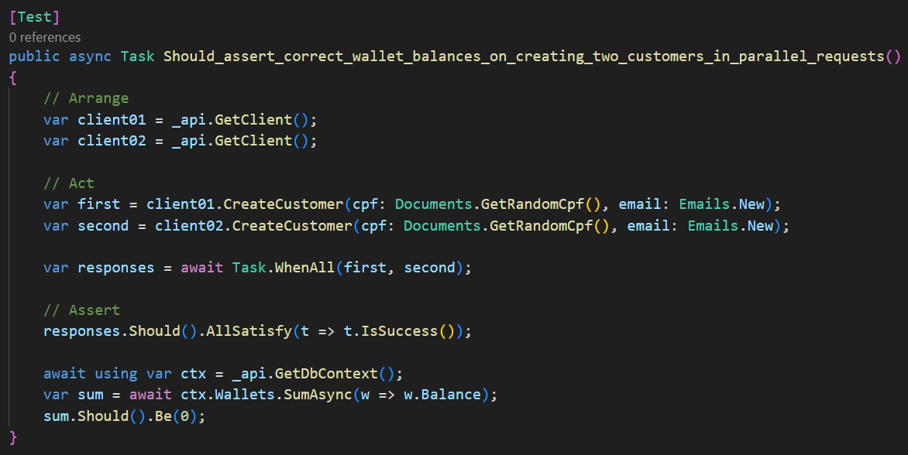

- Uma notificação deve ser enviada para o cliente com a menssagem: "Bônus de Boas-Vindas no valor de R$ 10,00"

  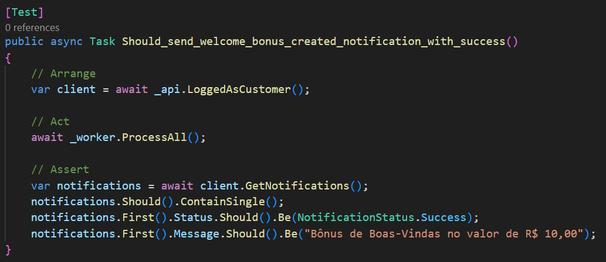

### Transferência de dinheiro
- Cliente pode transferir para um lojista

- Cliente pode transferir para outro cliente

- Não pode transferir valor <= 0

- Nâo pode transferir pra uma carteira inexistente

- Não pode transferir para si próprio

- Não pode transferir sem saldo suficiente

- Não pode transferir caso seja não autorizado

Nesse caso configurei para o Autorizador retornar "false" quando receber o valor de R$ 6,66

  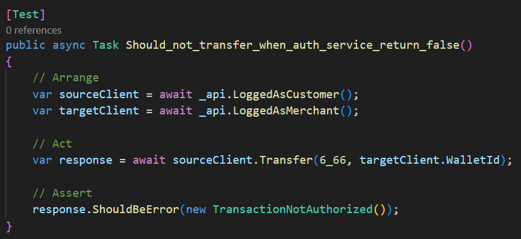

- Não pode transferir caso o autorizador esteja fora do ar

Nesse caso configurei para o Autorizador retornar "504 Gateway Timeout" quando receber o valor de R$ 5,04

  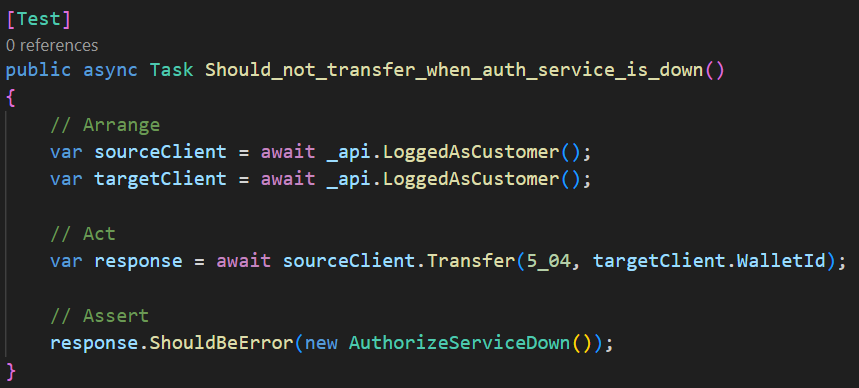

- Não deve transferir em paralelo, gastando mais que o saldo
    - Tenho R$ 10,00 de saldo, não posso realizar duas transferências de R$ 8,00 ao mesmo tempo
    - Apenas uma delas deve ser feita, a outra deve retornar erro
    - Se forem duas de R$ 4,00 ambas devem ser realizadas com sucesso

  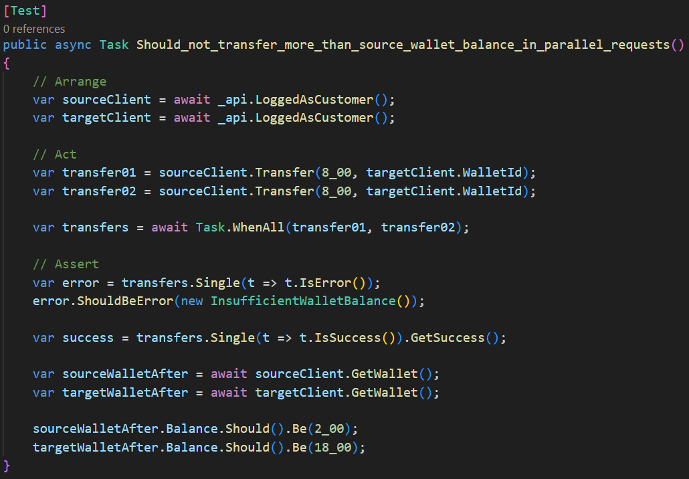

- Quem recebe duas transferências ao mesmo tempo deve acabar com o saldo correto
    - Um lojista recebendo vários pagamentos de maneira simultânea deve se manter com saldo consistente
    - O lojista possui saldo de R$ 5,00
    - Dois clientes transferem R$ 8,00 cada pro lojista ao mesmo tempo
    - O saldo final do lojista deve ser de R$ 21,00

  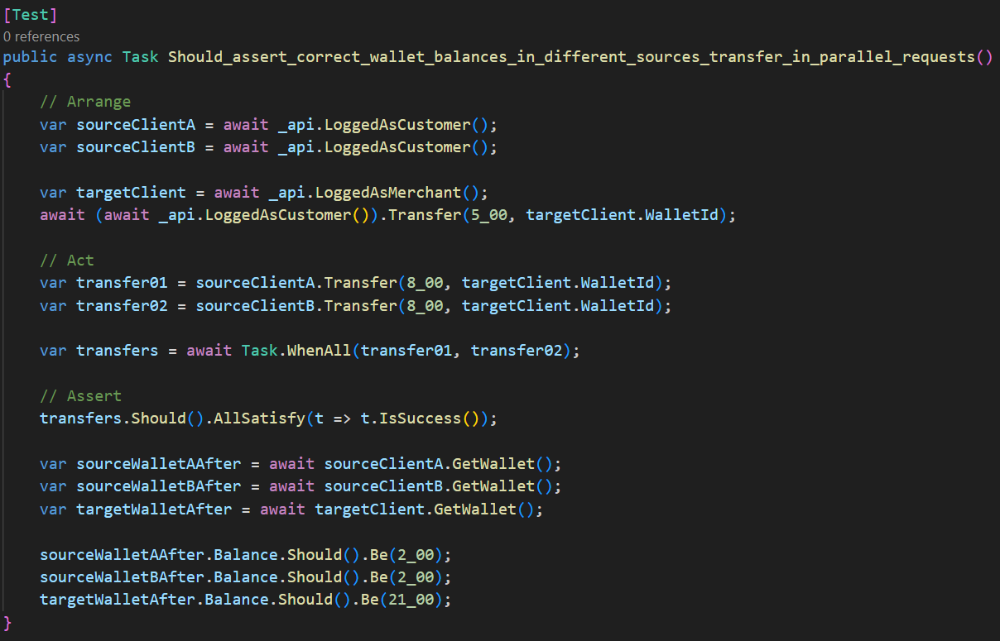

- Quem enviar pra X e receber de Y ao mesmo tempo deve acabar com o saldo correto
    - Maria possui R$ 5,00 de saldo, Zezinho possui R$ 8,00 e o lojista Gilbirdelson possui R$ 10,00
    - Maria envia R$ 2,00 pra Gilbirdelson e, no exato mesmo instante, Zezinho envia R$ 6,00 pra Maria
    - Maria deve terminar com saldo de R$ 9,00
    - Gilbirdelson com R$ 12,00
    - Zezinho com R$ 2,00

  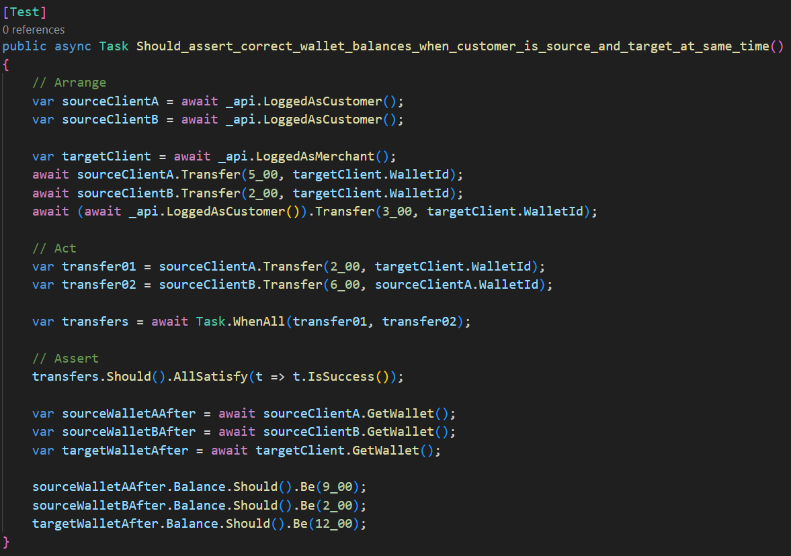

- Quem enviar pra X e receber de X ao mesmo tempo deve acabar com o saldo correto
    - Maria possui R$ 10,00 de saldo e Zezinho possui R$ 10,00
    - Maria envia R$ 6,00 pra Zezinho e, no exato mesmo instante, Zezinho envia R$ 2,00 pra Maria
    - Maria deve terminar com saldo de R$ 6,00 e Zezinho com R$ 14,00
    - Se não tratado, isso pode gerar um deadlock no banco de dados

  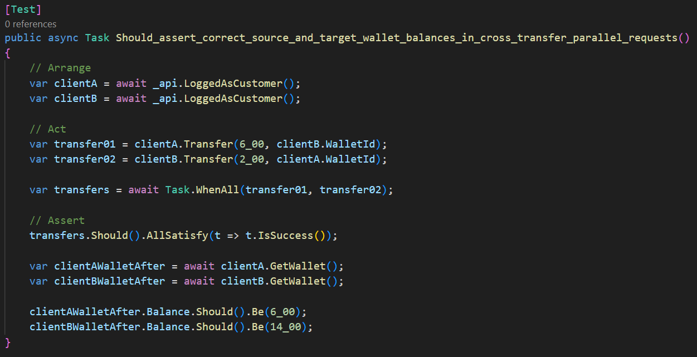

- Ao final, o recebedor (cliente ou lojista) deve ser notificado da transação

  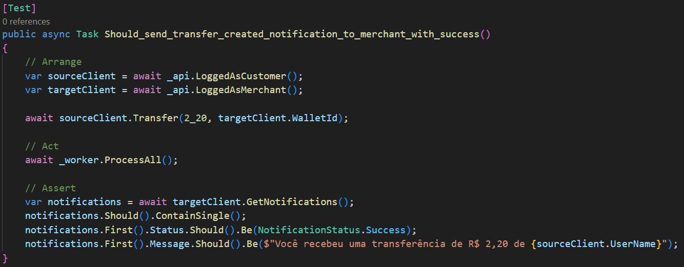

### Notificações do Cliente
- Listar todas as notificações do cliente, ordenadas pela mais recente

  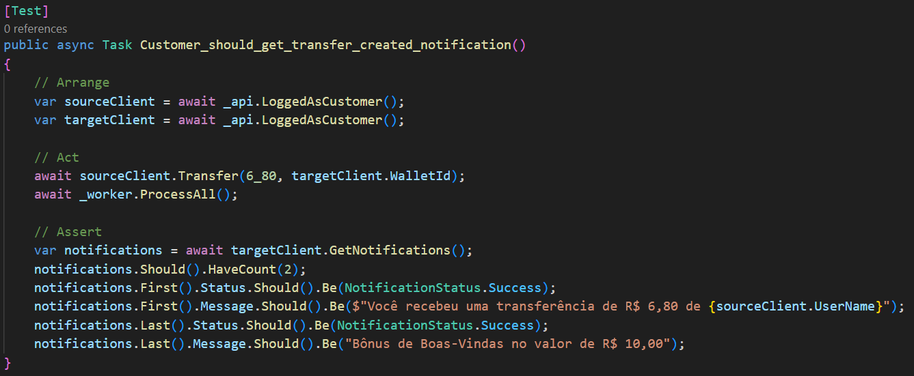

### Notificações do Lojista
- Listar todas as notificações do lojista, ordenadas pela mais recente

  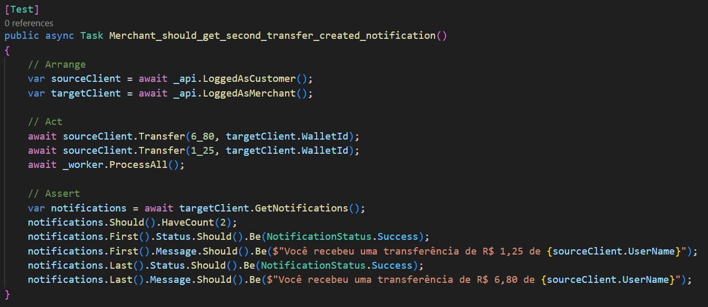

### Extrato de Transações do Cliente
- Listar todas as transações do cliente, ordenadas pela mais recente

  

### Extrato de Transações do Lojista
- Listar todas as transações do lojista, ordenadas pela mais recente

  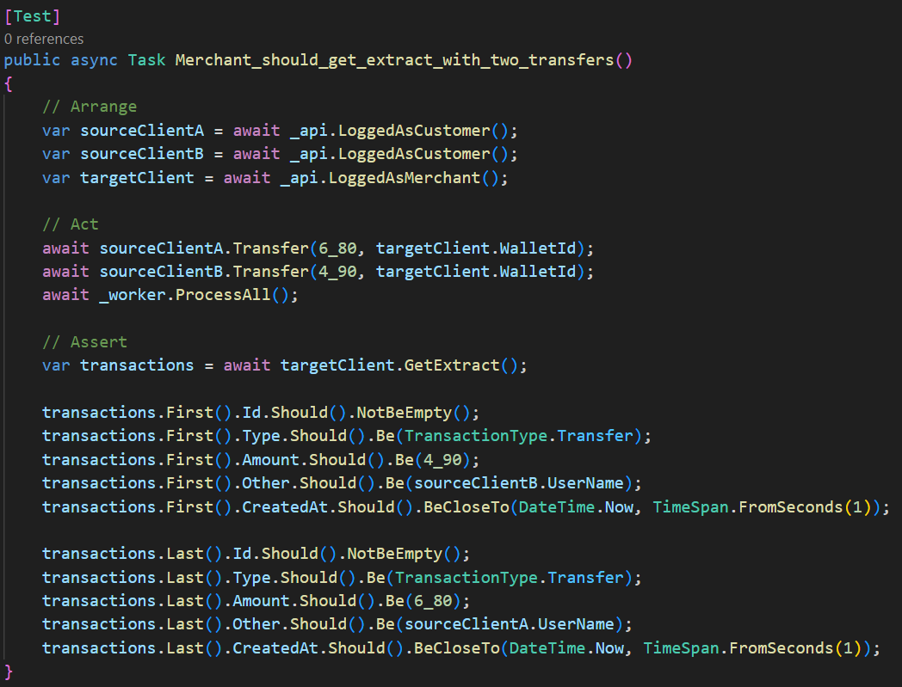

## Testes

- Testes de carga com o K6 (quantas transações podem ser efetuadas por s/min/h/dia)

- Para cada caso de uso, colocar um print ou code sniped do teste

- Auth e Notify devem se comportar dinâmicamente

## Referências

- Repositório original do desafio
    - https://github.com/PicPay/picpay-desafio-backend

- Descomplicando Clean Architecture, DDD e TDD com Desafio PicPay
    - O Nonato faz uma análise excelente dos requisitos e monta casos de uso/teste detalhados
    - https://youtu.be/u-jkRk-kKUM

- Picpay simplificado com Java e Spring Boot!
    - A Giuliana Bezerra desenvolve uma arquitetura robusta, com entrega assícrona das notificações
    - https://youtu.be/YcuscoiIN14

## Final

- Comente se vc conhece mais desafios de empresas
- O que faltou no projeto?
- Faca um fork do projeto e teste na sua maquina!
- Contribua com o projeto, abra um PR la!
